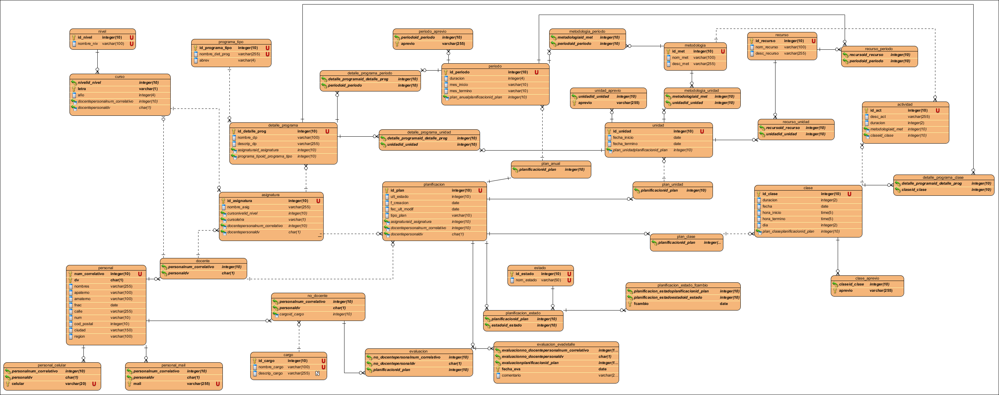

Thesis
=======

This is a thesis degree, entitled "Guide for the selection of the type of database evaluating the relational model, relational object model and semi structured data in XML".

Here you will find all the DDL for the study case, I also attached the ER diagram in order to give you more background about the study case.

##DER
First we have the entity diagram with all the attributes:

##DER without attributes
Second we have the entity diagram without attributes just to give us the needed context of the problem and be able of modeling the Entity relationship diagram.

##ERM
Third the entity relationship model with the "physical" tables

And here is the ER model detailed, the PK is in bold:

##ER

nivel(**id_nivel**,nom_nivel)
curso(**id_nivel**,letra,año,num_correlativo,dv)
programa_tipo(**id_pt**,nom_pt,abrev)
detalle_programa(**id_dp**,nom_dp,desc_dp,id_pt,id_asig)
personal(**num_correlativo,dv**,nombres,apaterno,amaterno,fnac,calle,num,cod_postal,
ciudad,region)
personalmail(**num_correlativo,dv,mail**)
personalcelular(**num_correlativo,dv,celular**)
docente(**num_correlativo,dv**)
no_docente(**num_correlativo,dv**,id_cargo)
asignatura(**id_asig**,nom_asig,id_nivel,letra,num_correlativo,dv)
cargo(**id_cargo**,nom_c,desc_c)
planificacion(**id_plan**,ult_estado,fcreacion,ult_modif,tipo_plan,num_correlativo,dv,
id_asig)
plan_anual(**id_plan**)
plan_unidad(**id_plan**)
plan_clase(**id_plan**)
periodo(**id_periodo**,duracion,mes_ini,mes_ter,id_plan_anual)
periodo_aprevios(**id_periodo,aprevio**)
estado(**id_estado**,nom_estado)
planificacion_estado(**id_plan,id_estado**)
planificacion_estado_fcambio(**id_plan,id_estado,fcambio**)
evaluacion(**num_correlativo,dv,id_plan**)
evaluacion_detalle(**num_correlativo,dv,id_plan,fecha_eva**,comentario)
metodologia(**id_met**,nom_met,desc_met)
metodologia_unidad(**id_met,id_unidad**)
metodologia_periodo(**id_met,id_periodo**)
recurso(**id_rec**,nom_rec,desc_rec)
recurso_unidad(**id_rec,id_unidad**)
recurso_periodo(**id_rec,id_periodo**)
recurso_actividad(**id_rec,id_act**)
actividad(**id_act**,desc_act,duracion,id_clase,id_met)
detalle_programa_unidad(**id_dp,id_unidad**)
detalle_programa_periodo(**id_dp,id_periodo**)
detalle_programa_clase(**id_dp,id_clase**)
