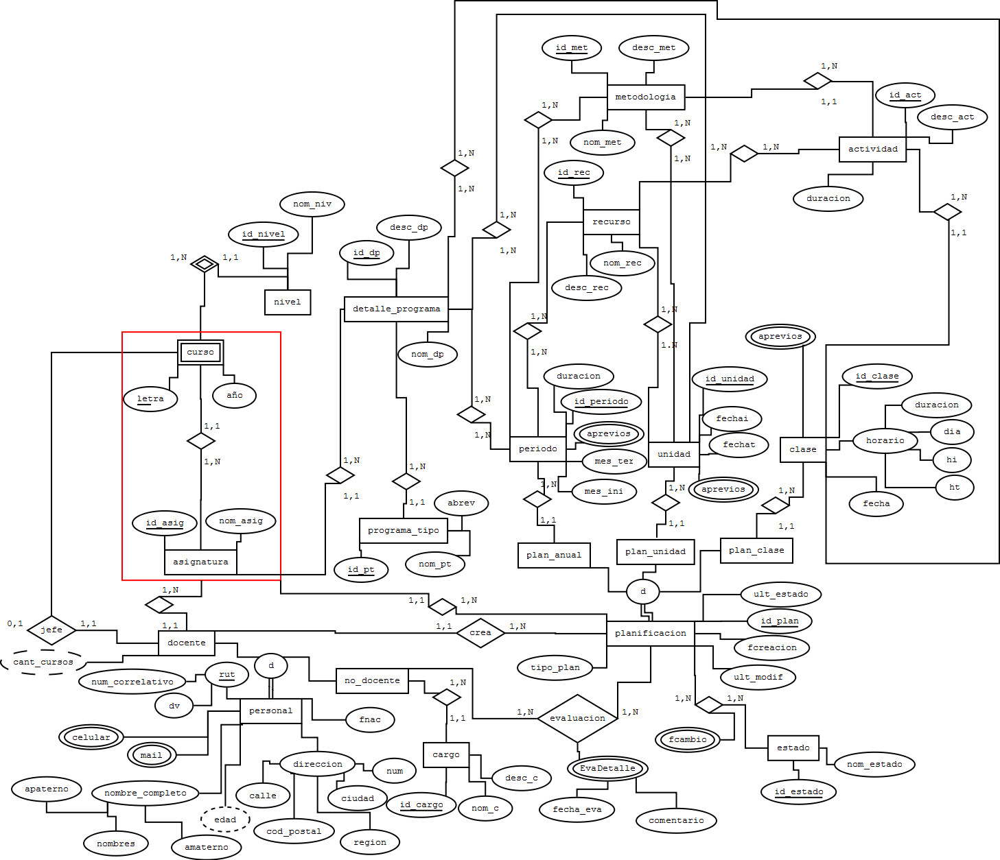
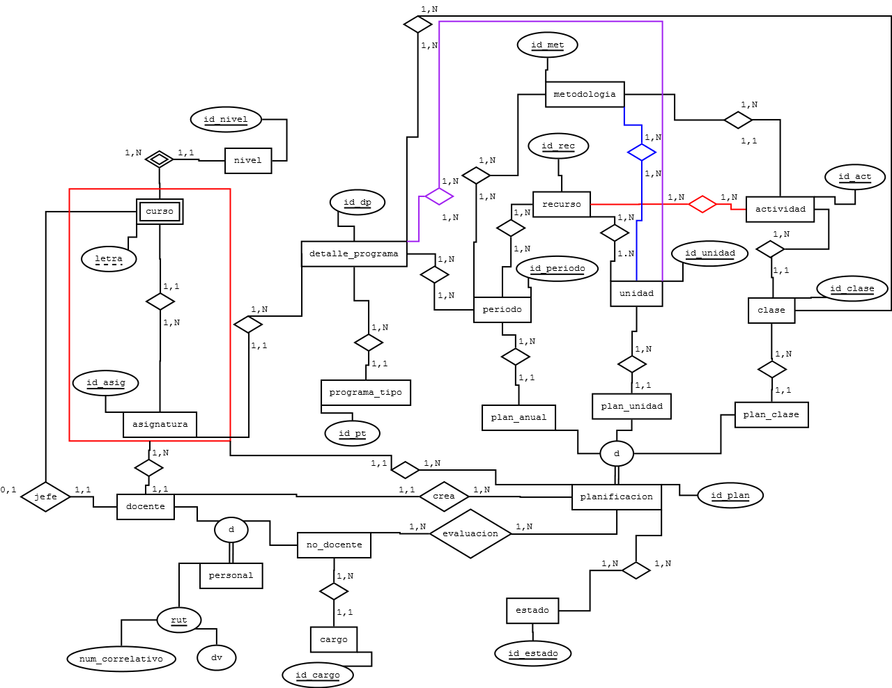

memoria
=======

This is a thesis degree, entitled "Guide for the selection of the type of database evaluating the relational model, relational object model and semi structured data in XML".

Here you will find all the DDL for the study case, I also attached the ER diagram in order to give you more background about the study case.

First we have the entity diagram with all the attributs:

Second we have the entity diagram without attributs just to give us the needed context of the problem and be able of modeling the Entity relationship diagram.

Third the entity relationship model with the "physical" tables

